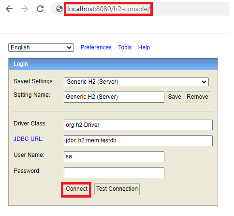
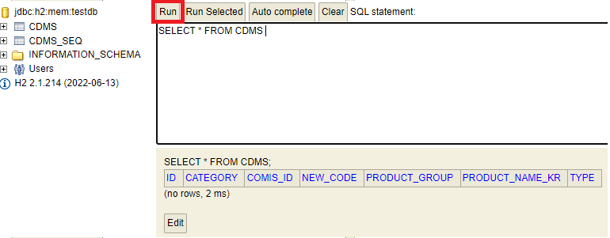

# MetadataAnalzeProgram

## MongoDB 의 메타데이터를 RDB 형식으로 매핑하는 프로그램입니다.

### 1. properties 파일 설정
- uri 와 db 정보를 수정합니다.

```xml
#MongoDB
spring.data.mongodb.uri=mongodb:{uri}
spring.data.mongodb.database={db}
logging.level.org.springframework.data.mongodb.core.MongoTemplate=DEBUG

#임시 RDB - H2database
spring.jpa.properties.hibernate.dialect=org.hibernate.dialect.MySQL5Dialect
spring.jpa.properties.hibernate.dialect.storage_engine=innodb
spring.datasource.hikari.jdbc-url=jdbc:h2:mem:testdb;MODE=MYSQL
spring.datasource.hikari.username=sa

spring.h2.console.enabled=true

spring.jpa.show-sql=true
spring.jpa.database-platform=org.hibernate.dialect.H2Dialect
spring.jpa.hibernate.ddl-auto=create

#view 경로
spring.mvc.view.prefix=/templates/
spring.mvc.view.suffix=.html
```

### 2. 메타데이터와 매핑할 코드 리스트(csv 파일)가 있는 폴더 경로 설정

[ReadCOMISCodeFileService.java](http://ReadCOMISCodeFileService.java)

```java
private static File[] getFiles() {
        String folderPath = "폴더 경로";
        File folder = new File(folderPath);
        return folder.listFiles();
}
```

### 3. 프로그램 실행 후 RDB 확인 방법


- localhost:port/h2-console/ 로 접속
- Connect 누름
- 콘솔창에서 query 를 입력하여 확인 가능


### 4. 주의사항

- COMIS의 product_id 는 고유값(unique)이 아닙니다. _id 값이 primary key 입니다.
- product_group 항목은 Array 형식이어야 MongoDB 에서 정상적으로 조회가 가능합니다.
- 또한 product_group 을 매핑할 때에는 전체 Array 항목이 같도록 해야 합니다(MongoDB $all 조건이기 때문 → ex. product_group이 [”SFC”,”AWS”] 인 자료를 조회할 때, [”SFC”] 만 입력하면 검색되지 않습니다.
- MongoTemplate 을 사용하고 있지만 Test Code를 참고하여 MongoRepository도 사용 가능합니다.